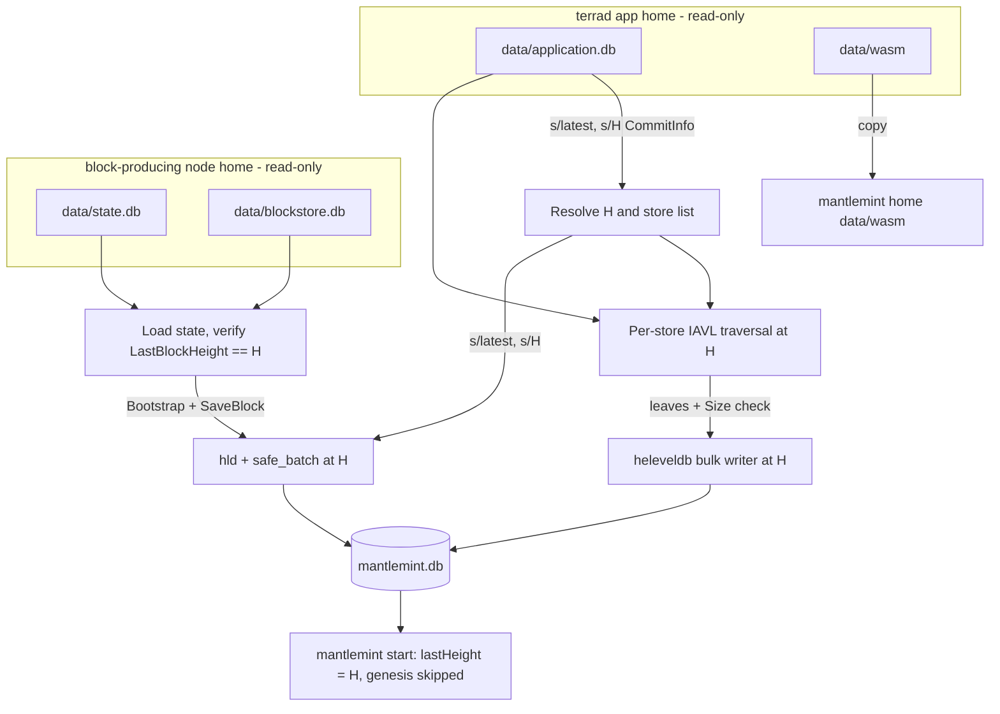
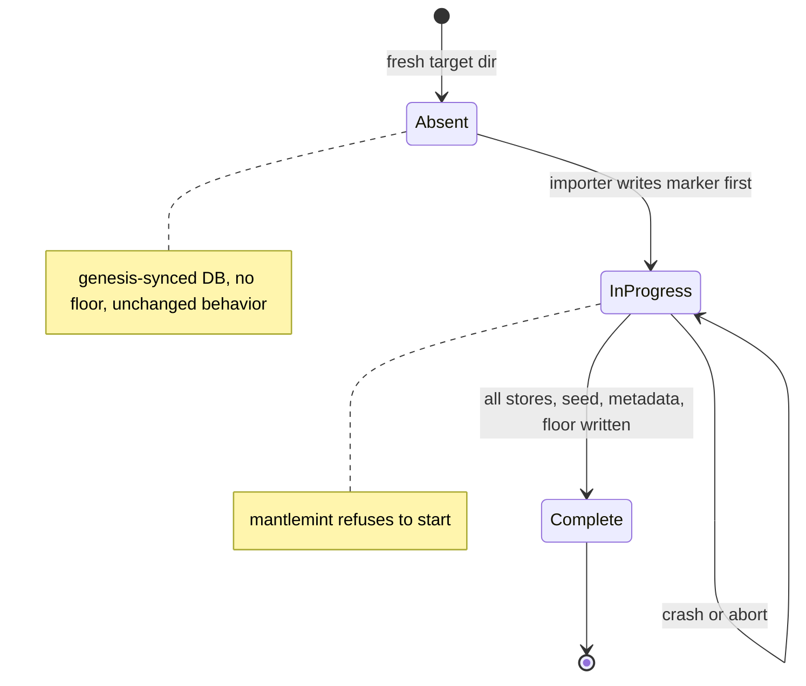

# feat: Bootstrap mantlemint from a terrad data directory

## Summary

Add an offline importer that reads a stopped terrad node's data directory at height H and writes a mantlemint database that starts at H instead of genesis. The importer copies module state, the CometBFT state for H, commit metadata, and wasm blobs. Mantlemint gains a height floor, so queries below H fail loudly instead of returning empty results.

---

## Problem Frame

Mantlemint can only initialize from genesis, and that sync takes weeks on Terra Classic. As a result, mantlemint releases ship to Allnodes without ever being run near a fork barrier (see origin: `docs/brainstorms/2026-09-16-mantlemint-snapshot-bootstrap-requirements.md`).

This plan covers only what makes such rehearsals possible. Running them, and any query-diff harness, is maintainer-driven and out of scope.

---

## Requirements

**Import source**

- R1. The importer takes a stopped terrad home and an optional target height, defaulting to the latest committed version. It needs no running terrad, no terrad binary, and no prior `snapshots export`.
- R2. The store list comes from the `CommitInfo` stored at H. Adding or removing a module needs no importer change.

**Written state**

- R3. Every leaf is written at height H, in the same on-disk layout a block inject produces: current value, iterator key index, and height-suffixed record.
- R5. The CometBFT state and block H come from the node that will produce blocks H+1 onward. The import fails if that state's last block height is not H. Wasm blobs are copied alongside.
- R8. The importer reports leaf counts per store and aborts if any count disagrees with the source tree.

**Mantlemint behavior**

- R4. Queries at an explicit height below H return an error, never an empty success.
- R6. After import, mantlemint starts at H with no genesis run and consumes blocks through the existing feed, unchanged.

The origin's R7, the differential query harness, is removed from scope at the maintainer's direction.

---

## Key Technical Decisions

- **Bulk writes bypass `safe_batch` and go through a new writer in `db/heleveldb`.** `safe_batch` buffers the whole batch in RAM. Its rollback wrapper doubles that buffer and does a point read per physical key, so a full-state import would run out of memory. A rollback batch is meaningless for a fresh target DB anyway. The writer lives next to the existing key helpers in `db/heleveldb/types.go`, so the layout is defined once.
- **Metadata and CometBFT writes go through the normal stack.** These writes are small, so they use `hld` + `safe_batch` with a single Open/Flush at H. That reuses CometBFT's own `state` store `Bootstrap` and `BlockStore.SaveBlock` plus rootmulti's metadata keys instead of reimplementing their formats.
- **Source trees are read by traversal, from a read-only DB, with fast-storage upgrade skipped.** Traversal works at any retained height. With `skipFastStorageUpgrade=false`, `LoadVersion` would rewrite the whole fast-node index, which takes hours and cannot work on a read-only DB anyway. The read-only open takes a shared lock, so it fails fast if terrad is still running, and it replays an unclean WAL into memory without mutating anything.
- **Leaf count must equal `ImmutableTree.Size()`.** The tree root records an exact leaf count, so a mismatch proves the traversal or the write path dropped data. This is the importer's main correctness signal now that no query harness exists.
- **The floor lives in the target DB as import metadata.** It is enforced in the `heleveldb` driver for explicit heights below the floor. A config value could drift from the data it describes; a floor written at import travels with the database. DBs synced from genesis have no floor key and behave as before. This resolves the origin's open question.
- **Import state is tracked with a marker.** The importer refuses a non-empty target, marks the import "in progress" first, and marks it "complete" last. Mantlemint refuses to start on an in-progress marker, so a crashed import cannot be served.
- **App state and CometBFT state have separate source flags.** The CometBFT home defaults to the app home. They differ when blocks come from a different node than the app state, as with a transformed testnet node (see origin R5).
- **The importer is a separate binary, `cmd/mantlemint-import`.** The production binary's build and `Dockerfile` stay untouched. `config.NewConfig` panics on missing env vars and a missing `app.toml`, so the importer takes flags instead. Importing core app packages is avoided, so the importer does not link wasmvm.
- **Stores are imported concurrently with a bounded worker pool.** Traversal is bound by random reads, and each store is an independent key range.

---

## High-Level Technical Design

### Data flow

### Import marker lifecycle

### Physical layout written per logical key

Mode is `DriverModeKeySuffixDesc`, as wired in `sync.go`.

| Physical key | Value | Why it is mandatory |
|---|---|---|
| `0x00 ‖ key` | raw value | reads at the latest height |
| `0x01 ‖ key` | empty | key universe for every explicit-height iteration |
| `0x02 ‖ key ‖ BE(MaxUint64 − H)` | `0x00 ‖ value` | reads at explicit heights ≥ H |

Logical keys are `s/k:<store>/<leaf key>` for module state. The `s/latest` and `s/<H>` metadata keys use the same expansion.

---

## Implementation Units

### U1. Bulk writer in heleveldb

**Goal:** Write large volumes of logical keys at one height, in the driver's layout, in bounded-memory chunks.

**Requirements:** R3

**Dependencies:** none

**Files:**
- `db/heleveldb/bulk_writer.go` (new)
- `db/heleveldb/leveldb_batch.go` (extract the shared triple-write into a helper used by both paths)
- `db/heleveldb/bulk_writer_test.go` (new)

**Approach:**
- Write the same three physical keys as `LevelBatch.Set`, from one shared helper, so the layout cannot diverge.
- Write through a plain goleveldb batch on the driver session, with no rollback wrapper and no reads.
- Flush when buffered bytes cross a threshold, and also on close.
- The writer is safe for concurrent use by separate store workers. Each worker may hold its own writer.

**Patterns to follow:** `db/heleveldb/leveldb_batch.go` for key construction, and `db/snappy/snappy_db_test.go` for db-layer test shape (testify `assert`, same-package tests). Use `t.TempDir()`, since the driver needs a real directory.

**Test scenarios:**
- Happy path: write keys at H=100 and close; `Driver.Get(0, key)` returns the value and `Driver.Get(100, key)` returns the value.
- Happy path: `Driver.Iterator(100, nil, nil)` yields every written key in order, which proves the iterator key index was populated.
- Edge: an empty value round-trips as empty, not nil, matching `LevelBatch` semantics.
- Edge: writes crossing the flush threshold several times still read back complete.
- Integration: keys written by the bulk writer and by `LevelBatch.Set` at the same height produce byte-identical physical entries.

**Verification:** A bulk-written key is indistinguishable from an injected one at the latest height, at explicit heights, and under iteration.

### U2. Import metadata and height floor

**Goal:** Persist import metadata in the target DB and reject explicit-height reads below the floor.

**Requirements:** R4

**Dependencies:** U1

**Files:**
- `db/heleveldb/import_meta.go` (new: floor and marker read/write under a reserved prefix outside `0x00`–`0x02`)
- `db/heleveldb/leveldb_driver.go` (load floor at open; enforce in `Get`, `Has`, `Iterator`, `ReverseIterator` when `maxHeight != 0`)
- `db/heleveldb/import_meta_test.go` (new)

**Approach:**
- Use a reserved prefix, such as `0x03`, so metadata can never collide with data or appear in iteration.
- An absent floor means floor 0, so existing DBs keep their current behavior.
- The marker has two states, in-progress and complete. It is the only signal of a finished import.

**Test scenarios:**
- Happy path: with floor 100, `Get(150, key)` succeeds and `Get(100, key)` succeeds.
- Error path: with floor 100, `Get(99, key)`, `Has(99, key)`, and `Iterator(99, …)` each return a non-nil error.
- Edge: with floor 100, `Get(0, key)` (latest) is unaffected.
- Edge: a DB with no floor key serves `Get(1, key)` exactly as before.
- Happy path: the marker round-trips in-progress → complete, and it reads as absent on a fresh DB.

**Verification:** Below-floor reads error; all other reads behave as they did before the change.

### U3. Startup guard in mantlemint

**Goal:** Mantlemint refuses to serve a half-imported DB and logs the floor when one is present.

**Requirements:** R4, R6

**Dependencies:** U2

**Files:**
- `sync.go`

**Approach:**
- After the driver opens, read the marker. If the import is in progress, stop with a clear message before the app is constructed.
- Log the floor and the starting height when the DB was imported.
- The rest of startup is unchanged. `mm.Init` already skips genesis when the loaded state height is nonzero (`mantlemint/reactor.go`).

**Test scenarios:**
- Test expectation: none as a unit test, because `sync.go` is an untestable `main` with no test harness. The guard's decision logic lives in U2's marker read and is covered there. U6 covers startup against an imported DB.

**Verification:** Starting on an in-progress DB exits before app construction with a message naming the marker. Starting on a complete import logs the floor.

### U4. Source app-state reader

**Goal:** Resolve H and the store list from a terrad `application.db`, then stream each store's leaves at H with an exact count check.

**Requirements:** R1, R2, R8

**Dependencies:** none

**Files:**
- `importer/appstate.go` (new)
- `importer/appstate_test.go` (new)

**Approach:**
- Open `application.db` read-only through cosmos-db's options-based goleveldb constructor, and set a bloom filter explicitly.
- Read `s/latest` when no height is given. Read `CommitInfo` at `s/<H>` and fail clearly when it is absent, which means H was pruned or never existed.
- For each store in `CommitInfo`, open a prefix DB at `s/k:<name>/`. Build a mutable tree with `skipFastStorageUpgrade=true` and a small node cache, check `VersionExists(H)`, and traverse the immutable tree at H.
- Hand each leaf to a callback, then compare the emitted count with `Size()`.
- Distinguish a pruned version (`ErrVersionDoesNotExist`) from a missing node, which indicates corruption, in the error messages.

**Patterns to follow:** `store/rootmulti/store.go` (`getCommitInfo`, and `s/k:` prefixing in `loadCommitStoreFromParams`). The iavl `cmd/iaviewer` read path is a reference, but do not copy its `skipFastStorageUpgrade=false`.

**Test scenarios:**
- Happy path: build two stores in a temp goleveldb with iavl, save versions 1–3, and write `CommitInfo` plus `s/latest`. Reading at the default height yields version 3's leaves for both stores, and each count equals `Size()`.
- Happy path: reading at H=2 yields version 2's values, not version 3's, for a key changed in version 3.
- Edge: a store that is empty at H yields zero leaves and passes the count check.
- Error path: H with no `CommitInfo` fails with a message naming the height.
- Error path: H below a store's first retained version fails with a pruned-version message.
- Error path: opening while another handle holds the DB exclusively fails without modifying anything.

**Verification:** For a fixture DB, every leaf at H is emitted exactly once per store and counts match `Size()`.

### U5. CometBFT state seed

**Goal:** Copy the CometBFT state and block H from the block-producing node into the target through the normal stack.

**Requirements:** R5, R6

**Dependencies:** none

**Files:**
- `importer/cometseed.go` (new)
- `importer/cometseed_test.go` (new)

**Approach:**
- Open `state.db` and `blockstore.db` read-only with cometbft-db. Load the state and fail if it is empty or `LastBlockHeight != H`.
- Write into the target through `hld` at write height H, inside one `safe_batch` Open/Flush, using `wrapped.NewWrappedDB` exactly as `mantlemint.NewMantlemint` does.
- Use the state store's `Bootstrap`. It works from `LastBlockHeight + 1`, so it writes the state plus validator records at H, H+1, H+2 and consensus params at H+1. `ApplyBlock` panics without those validator records.
- Copy block H with its part set and seen commit through `BlockStore.SaveBlock`. A fresh store with base 0 accepts a non-contiguous first block.
- Reject a source where vote extensions are enabled at H, since that path needs an extended commit this seed does not copy.

**Patterns to follow:** `mantlemint/reactor.go` and `mantlemint/executor.go` for how state and block stores wrap the batched DB.

**Test scenarios:**
- Happy path: seed a source with a valid state at H=50 and block 50. After import, the target state store loads the same `ChainID`, `LastBlockHeight`, `AppHash`, `LastResultsHash`, and validator set hashes.
- Happy path: the target's `LoadValidators(50)`, `LoadValidators(52)`, and `LoadConsensusParams(51)` succeed, and the target block store reports height 50 with the same block hash.
- Error path: a source state at height 49 when H=50 fails, and the message names both heights.
- Error path: an empty source state fails with a message pointing at the CometBFT home flag.

**Verification:** A state store and block store built over the target return the source's state and block H unchanged.

### U6. Importer orchestration and binary

**Goal:** A runnable importer that assembles U1, U2, U4, and U5 into one ordered, crash-safe import.

**Requirements:** R1, R3, R5, R6, R8

**Dependencies:** U1, U2, U3, U4, U5

**Files:**
- `importer/importer.go` (new)
- `cmd/mantlemint-import/main.go` (new)
- `Makefile` (add a `build-import` target)
- `importer/importer_test.go` (new)

**Approach:**
- Flags: app home, CometBFT home (defaulting to app home), mantlemint home, mantlemint DB name (defaulting like `config.go`), optional height, worker count, and skip-wasm.
- Order of operations: refuse a non-empty target; write the in-progress marker; import stores concurrently through U1 writers; seed CometBFT through U5; write `s/latest` and `s/<H>` `CommitInfo` through the stack at H; copy `data/wasm`; write the floor; write the complete marker.
- Log progress per store with leaf rate, then print a final per-store count table.
- Any failure leaves the marker in progress and exits non-zero.

**Patterns to follow:** `sync.go` for constructing driver → `hld` → `safe_batch`. Logging uses `fmt.Printf` with a bracketed subsystem prefix.

**Test scenarios:**
- Integration: import the U4 fixture at H=3 with a U5-style seed at H=3. Then build the same stack `sync.go` builds, including `rootmulti.NewStore`. A key reads correctly at latest and at H=3, iteration over a store prefix at H=3 returns every key, and a read at height 2 errors.
- Integration: after import, `mantlemint.NewMantlemint` over the target reports `GetCurrentHeight() == 3`, and `Init` does not run genesis.
- Integration: rootmulti `LoadLatestVersion` on the target succeeds and reports version 3.
- Error path: a non-empty target directory is refused before anything is written.
- Error path: a failure injected after the store imports leaves the marker in progress.
- Edge: with skip-wasm set, no `data/wasm` directory is created. Without it, the source files are copied byte-identical.

**Verification:** An imported fixture DB opens through mantlemint's real stack at H, with correct reads, working iteration, and an enforced floor.

### U7. Operator documentation

**Goal:** Document how to run the importer and what an imported node is not.

**Requirements:** R1, R4, R5

**Dependencies:** U6

**Files:**
- `README.md`

**Approach:**
- Add a section with prerequisites: stop terrad, keep `CHAIN_ID` equal to the seeded state's chain ID, and provide `GENESIS_PATH`, which is still read at startup.
- Explain choosing the CometBFT home when blocks come from a different node than the app state.
- State the two gaps below H: explicit-height queries error, and the tx index is permanently empty below H.
- Point out that wasm cache issues show up as unresponsiveness, and link README Q8.
- Update Q7 ("Are snapshots provided?") to point at the importer.

**Test expectation:** none — documentation only.

**Verification:** A maintainer can run an import from the README alone.

---

## Scope Boundaries

### Deferred for later

Carried from origin:
- Third-party pruned snapshot tarballs from untrusted sources.
- Production disaster recovery.
- Publishing mantlemint snapshots for other operators.
- Reworking `Restore()` in `store/rootmulti/store.go` into a working snapshot-stream sink.

### Outside this product's identity

Carried from origin: an imported node is not an archival node. It has no state history and no tx index below H, and it must never be presented as a replacement for a genesis-synced mantlemint serving historical queries.

### Deferred to Follow-Up Work

- Running rehearsals and any query-diff harness, which the maintainer drives.
- Sequential fast-node scan of the `f` prefix when H is the latest version. Take this up if measured traversal throughput is too slow.
- Tx and block indexer backfill below H. Read the removed lazy-sync design first (`git show 870f411`).
- Packaging the importer in `Dockerfile` or release tarballs.
- Removing the dead, panicking `HeightLimitedDBIterator.Key()` in `db/hld/height_limited_iterator.go`.
- Wiring `in-place-testnet` into classic-terra/core, which lives in another repo.

---

## Risks & Dependencies

| Risk | Mitigation |
|---|---|
| Startup writes default params at `initialHeight` before loading state. On an imported DB, this could overwrite imported current values. | This already happens on every restart of a synced node. U6's integration test reads a param-store key after a full stack construction and must see the imported value. |
| Traversal throughput on mainnet-scale state is unmeasured. It is random-read bound. | Per-store rate logging (U6) and concurrent stores. The fast-node scan is ready as a follow-up. |
| Terra Classic's `application.db` may contain legacy iavl nodes with sparse legacy versions. | iavl v1.2.6 reads both formats. U4 errors name the store and height so a legacy gap is diagnosable. |
| The floor error may reach LCD clients as something other than a clear failure. | U2 guarantees a driver error. Confirming the LCD response shape is an implementation-time check. |
| `in-place-testnet` is not registered in classic-terra/core v4, and terrad's app creator ignores its testnet keys. | The importer does not depend on the block source. The separate CometBFT home flag supports whatever node produces the blocks. |
| Disk usage roughly doubles the logical state, plus a full copy of the keyspace for the iterator index. | Document it in U7. |
| The importer might pull in wasmvm through transitive imports, which requires the private forks to build. | Keep `importer/` free of core app packages. Check the dependency graph before landing U6. |

---

## Open Questions

**Deferred to implementation**
- Flush threshold for the bulk writer and default worker count. Tune these against a real `application.db`.
- Exact reserved-prefix byte and marker encoding in U2.

---

## Sources & Research

- `db/heleveldb/leveldb_batch.go`, `db/heleveldb/leveldb_iterator.go`: the triple-write layout, and iteration walking the `0x01` key index.
- `db/safe_batch/safe_batch.go`, `db/rollbackable/rollbackable_batch.go`: the in-memory batch and per-key backup read that rule out full-state import through this path.
- `store/rootmulti/store.go` (`loadVersion`, `getCommitInfo`): restart requires `CommitInfo` at `s/<H>`.
- `mantlemint/reactor.go`: `Init` skips genesis when the loaded height is nonzero; `Inject` overwrites `AppHash`.
- cometbft v0.38.21 `state/store.go` (`Bootstrap`), `state/execution.go` (`buildLastCommitInfoFromStore` panics without validators at H), and `store/store.go` (`saveBlockToBatch` allows a first block when base is 0).
- iavl v1.2.6 `mutable_tree.go` (`LoadVersion` fast-storage rewrite when not skipped; `VersionExists`) and `immutable_tree.go` (`Size`, `Iterate`).
- cosmos-sdk v0.53.6 `server/start.go` (`testnetify`) and classic-terra/core v4.0.1-patch.3 `cmd/terrad/root.go`: in-place-testnet is not registered in terrad.
- classic-terra/core v4.0.1-patch.3 `app/keepers/keepers.go`: the wasm directory is `<home>/data`.
